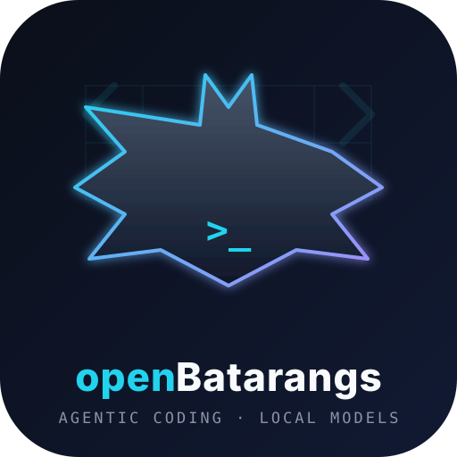

<div align="center">



# openBatarangs

> *Agentic coding CLI for local models.*
>
> *Auto-discovers the best model on your hardware,*
> *thinks, reads, edits, and verifies —*
> *no manual model ops, no cloud required.*

**A DeepCode-style autonomous coding agent that runs on Jetson-class edge devices and anywhere Ollama runs.**

[](https://github.com/arpanpathak/openbatrangs/releases) [](https://github.com/arpanpathak/openbatrangs) [](LICENSE) [](CONTRIBUTING.md)

[](https://www.rust-lang.org) [](https://ollama.com) [](https://www.nvidia.com/en-us/autonomous-machines/embedded-systems/jetson-orin/) [](https://github.com/arpanpathak/openbatrangs)

[](https://github.com/arpanpathak/openbatrangs) [](https://github.com/arpanpathak/openbatrangs) [](https://github.com/arpanpathak/openbatrangs)

[](https://github.com/arpanpathak/openbatrangs/actions/workflows/ci.yml) [](https://codecov.io/gh/arpanpathak/openbatrangs)

</div>

---

openBatarangs is an **agentic coding CLI** for local LLMs. It talks to an
[Ollama](https://ollama.com) server, auto-discovers the best installed model for
your hardware, and iterates with tools to explore, edit, and verify code —
no manual model selection required.

It is designed to run well on Jetson-class edge devices (Orin Nano/NX Super,
16 GB unified memory) and on any desktop/laptop that can run Ollama.

## Why Ollama?

- Same `llama.cpp` + CUDA/ROCm/Metal engine used by most local LLM tools.
- Auto-discovers installed models through the Ollama API.
- No heavy Rust/CUDA compile per machine.
- Best performance-per-watt-per-dollar for local agentic coding on edge devices.

## Performance per watt per dollar

openBatarangs is built around the local-first economics of edge AI:

- **No cloud API fees.** Every prompt stays on-device; the only cost is electricity.
- **Unified memory wins on Jetson.** The Orin 16 GB's GPU/CPU share memory, so a
  4-7 GB Q4_K_M coding model fits without duplicating weights across VRAM and RAM.
- **Small quantized models beat big cloud round-trips for agentic loops.**
  A 3B-8B Q4 coding model is fast enough to iterate (read → edit → build → fix)
  while leaving headroom for a 32K+ context window.
- **The auto-picker optimizes for watts, not just raw tokens/sec:** it refuses
  models that don't fit comfortably, avoiding swap thrash and thermal throttling.
- **Same binary runs on Jetson, laptops, and desktops** — you only pay for the
  hardware you already own.

Exact tok/s depends on clocks, thermals, and model size; run `openbatrangs doctor`
to see which model your hardware scores best for this workload.

## Requirements

- [Ollama](https://ollama.com) installed (the CLI auto-starts `ollama serve` if it is installed but not running).
- If Ollama is not installed at all, run `openbatrangs setup` once — it installs Ollama and pulls a coding model for you.
- If no suitable model is installed, openBatarangs auto-pulls a recommended coding model unless you pass `--no-auto-pull`.

## Install / Build

```sh
git clone https://github.com/arpanpathak/openbatrangs.git
cd openbatrangs

# Build release
cargo build --release

# Or install the binary into ~/.cargo/bin
cargo install --path .
```

The binary is at `target/release/openbatrangs` (or `~/.cargo/bin/openbatrangs`).

### Prebuilt binaries (easiest)

Download from the latest GitHub release:

```sh
# Linux x86_64 (most desktops/laptops)
curl -fsSL -o openbatrangs https://github.com/arpanpathak/openbatrangs/releases/latest/download/openbatrangs-x86_64-unknown-linux-gnu

# Linux aarch64 (Jetson, Raspberry Pi 5, Apple silicon Linux)
curl -fsSL -o openbatrangs https://github.com/arpanpathak/openbatrangs/releases/latest/download/openbatrangs-aarch64-unknown-linux-gnu

chmod +x openbatrangs
./openbatrangs setup
./openbatrangs
```

Or use the installer:

```sh
curl -fsSL https://github.com/arpanpathak/openbatrangs/releases/latest/download/install.sh | sh
```

## Quick start

```sh
# One-time auto setup: install/start Ollama + pull a coding model
openbatrangs setup

# Interactive mode starts in chat (no tools); type /mode agent for full agent
openbatrangs

# One-shot agent mode with a task
openbatrangs "fix the Rust build errors"

# One-shot agent in a specific directory
openbatrangs --cwd /path/to/project "add a --dry-run flag"

# See what models are installed and which is best
openbatrangs list-models

# Check Ollama and get a recommendation
openbatrangs doctor

# Force a specific model
openbatrangs --model qwen2.5-coder:7b "explain this repo"

# Read-only mode (no file writes or shell commands)
openbatrangs --read-only "suggest a refactor plan"

# Ask before every write/command
openbatrangs --confirm "update the CLI docs"
```

### Interactive REPL commands

Inside the `openBatarangs>` prompt:

```
/help          show all commands
/exit, /quit   leave the REPL
/setup         install/start Ollama + pull a model
/models        list installed models + scores
/model <tag>   switch model (e.g. /model qwen2.5-coder:7b)
/read-only     toggle read-only mode
/confirm       toggle confirm-before-write/command
/steps <n>     set max agent steps
/cwd <path>    change workspace
/doctor        check Ollama + best model
/mouse on|off  wheel/scrollbar capture (default on)
```

The interactive TUI starts in **chat** mode (no tools). Use `/mode agent` to
enable the full agentic loop, or `/mode plan` for read-only planning.

Anything else you type is sent to chat; in agent/plan mode it is sent to the
coding agent as a task.

## Agent tools

The agent can use these tools during a task. It does **not** scan the
workspace unless your task explicitly asks about the current directory,
project structure, codebase, or which files exist:

| Tool | Description |
| --- | --- |
| `list_files` | List files in a directory (max depth 2; skips `target`, `.git`, `node_modules`, `data`, build/cache dirs, etc.) |
| `read_file` | Read a text file with a size cap |
| `grep_files` | Regex search across workspace files |
| `write_file` | Write or overwrite a file (relative paths only) |
| `run_command` | Run a shell command in the workspace (e.g. `cargo check`) |
| `finish` | Signal the task is complete |

For safety:
- Tool paths must be relative; absolute paths and `..` are rejected.
- `--read-only` disables `write_file` and `run_command`.
- `--confirm` asks before each write/command.

## Model auto-discovery

`openBatarangs` scores installed models by:

- Memory fit (model file size vs. system memory)
- Parameter size sweet spot for agentic coding (roughly 3B–8B on 16 GB devices)
- Coding-model name bonus (`qwen2.5-coder`, `deepseek-coder`, etc.)
- Context window (target ~32K)
- Quantization quality

If nothing suitable is installed, it can automatically pull a recommended model
(`qwen2.5-coder:7b` on >=12 GB systems, otherwise `qwen2.5-coder:3b`).

## Common flags

```
--ollama-url <URL>   Ollama server URL (default http://localhost:11434)
--model <TAG>        Use a specific Ollama model tag
--cwd <DIR>          Workspace directory (default .)
--max-steps <N>      Max agent iterations (default 12)
--min-context <N>    Minimum context window for auto-selection (default 8192)
--read-only          Disable writes and shell commands
--confirm            Ask before writes/commands
--no-auto-pull       Never auto-pull models
```

## Roadmap

This is the first working version. Future steps for standalone distribution:

- Prebuilt binaries for `aarch64` and `x86_64`
- `cargo install` from crates.io
- Support OpenAI-compatible remote endpoints in addition to Ollama
- Optional direct GGUF fallback via `mistralrs` or `llama.cpp`
- Better token budgeting / context compression for long agent sessions
- Installer script that checks for Ollama and installs a recommended model

## License

[AGPL-3.0](LICENSE). Contributions are welcome; see [CONTRIBUTING.md](CONTRIBUTING.md).
